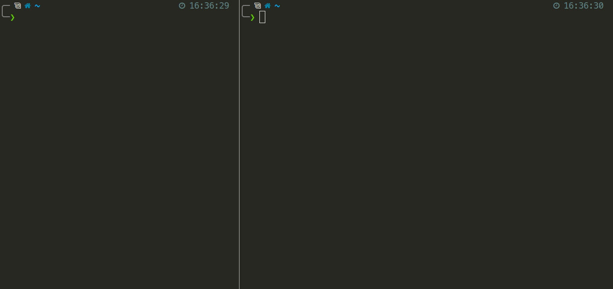
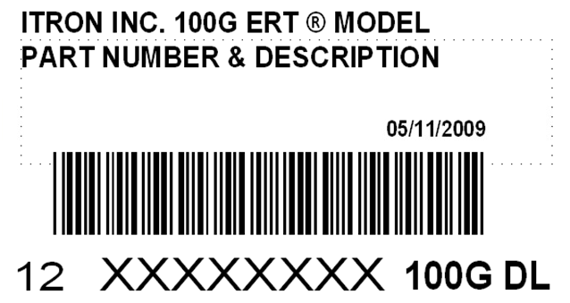
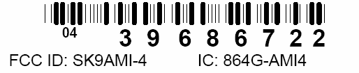
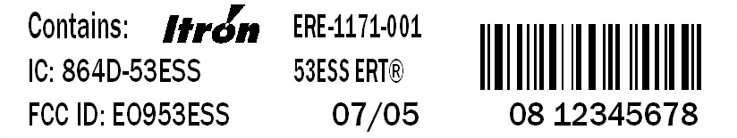

[](http://choosealicense.com/licenses/agpl-3.0/)

### Purpose

Utilities often use "smart meters" to optimize their residential meter reading infrastructure. Smart meters transmit consumption information in the various ISM bands allowing utilities to simply send readers driving through neighborhoods to collect commodity consumption information. One protocol in particular: Encoder Receiver Transmitter by Itron is fairly straight forward to decode and operates in the 900MHz ISM band, well within the tunable range of inexpensive rtl-sdr dongles.

This project is a software defined radio receiver for these messages. We make use of an inexpensive rtl-sdr dongle to allow users to non-invasively record and analyze the commodity consumption of their household.

There's now experimental support for data collection and aggregation with [rtlamr-collect](https://github.com/bemasher/rtlamr-collect)!

### Requirements

- GoLang >=1.11 (Go build environment setup guide: http://golang.org/doc/code.html)
- rtl-sdr
  - Windows: [pre-built binaries](https://ftp.osmocom.org/binaries/windows/rtl-sdr/)
  - Linux: [source and build instructions](http://sdr.osmocom.org/trac/wiki/rtl-sdr)

### Install
To install rtlamr, run the following:  
- For Go versions >= 1.16: 
```bash
go install github.com/bemasher/rtlamr@latest
```
- Or, for older versions of Go: 
```bash
go get github.com/bemasher/rtlamr
```

The command above will add the binary to `$HOME/go/bin/`, or if `$GOPATH` is set, `$GOPATH/bin/`.

To run the rtlamr binary from any directory, ensure the directory containing the binary is in your `PATH` ([more info](https://superuser.com/questions/284342/what-are-path-and-other-environment-variables-and-how-can-i-set-or-use-them)).

### Usage

See the wiki page [Configuration](https://github.com/bemasher/rtlamr/wiki/Configuration) for details on configuring rtlamr.

Running the receiver is as simple as starting an [`rtl_tcp`](https://osmocom.org/projects/rtl-sdr/wiki/Rtl-sdr) instance and then starting the receiver:

```bash
# Terminal A
$ rtl_tcp

# Terminal B
$ rtlamr
```

The animation below shows an example of starting rtlamr along with the successful capture of an ERT message.
  

---

If you want to run the spectrum server on a different machine than the receiver you'll need to specify an address to listen on with the `-a` flag for `rtl_tcp`, and the `-server` flag for `rtlamr`.

### Message Types

The following message types are supported by rtlamr:

- **scm**: Standard Consumption Message. Simple packet that reports total consumption.
- **scm+**: Similar to SCM, allows greater precision and longer meter ID's.
- **idm**: Interval Data Message. Provides differential consumption data for previous 47 intervals at 5 minutes per interval.
- **netidm**: Similar to IDM, except net meters (type 8) have different internal packet structure, number of intervals and precision. Also reports total power production.
- **r900**: Message type used by Neptune R900 transmitters, provides total consumption and leak flags.
- **r900bcd**: Some Neptune R900 meters report consumption as a binary-coded digits.

### Compatibility

Currently the only tested meter is the Itron C1SR and Itron 40G. However, the protocol is designed to be useful for several different commodities and should be capable of receiving messages from any ERT capable smart meter.

Check out the table of meters I've been compiling from various internet sources: [ERT Compatible Meters](https://github.com/bemasher/rtlamr/blob/master/meters.md)

User provided, but otherwise unverified compatible meters: [Google Sheets](https://docs.google.com/spreadsheets/d/1lTeHkk7rwFfq0joMWngrhnJA2nXAk4m82eApVaAKfhw/edit?usp=sharing)

Look for an FCC ID label on your meter, it should identify the two-digit commodity or endpoint type and the eight- or ten-digit endpoint ID of your meter: `## ########[##]`. Below are a few examples:





### Sensitivity

Using a NooElec NESDR Nano R820T with the provided antenna, I can reliably receive standard consumption messages from ~300 different meters and intermittently from another ~600 meters. These figures are calculated from the number of messages received during a 25 minute window. Reliably in this case means receiving at least 10 of the expected 12 messages and intermittently means 3-9 messages.

### Ethics

_Do not use this for malicious purposes._ If you do, I don't want to know about it, I am not and will not be responsible for your actions. However, if you find a clever non-evil use for this, by all means, share.

### Use Cases

These are a few examples of ways this tool could be used:

**Ethical**

- Track down stray appliances.
- Track power generated vs. power consumed.
- Find a water leak with rtlamr rather than from your bill.
- Optimize your thermostat to reduce energy consumption.
- Mass collection for research purposes. (_Please_ anonymize your data.)

**Unethical**

- Using data collected to determine living patterns of specific persons with the intent to act on this data, particularly without express permission to do so.

### License

The source of this project is licensed under Affero GPL v3.0. According to [http://choosealicense.com/licenses/agpl-3.0/](http://choosealicense.com/licenses/agpl-3.0/) you may:

#### Required:

- **Disclose Source:** Source code must be made available when distributing the software. In the case of LGPL, the source for the library (and not the entire program) must be made available.
- **License and copyright notice:** Include a copy of the license and copyright notice with the code.
- **Network Use is Distribution:** Users who interact with the software via network are given the right to receive a copy of the corresponding source code.
- **State Changes:** Indicate significant changes made to the code.

#### Permitted:

- **Commercial Use:** This software and derivatives may be used for commercial purposes.
- **Distribution:** You may distribute this software.
- **Modification:** This software may be modified.
- **Patent Grant:** This license provides an express grant of patent rights from the contributor to the recipient.
- **Private Use:** You may use and modify the software without distributing it.

#### Forbidden:

- **Hold Liable:** Software is provided without warranty and the software author/license owner cannot be held liable for damages.
- **Sublicensing:** You may not grant a sublicense to modify and distribute this software to third parties not included in the license.

### Feedback

If you have any questions, comments, feedback or bugs, please submit an issue.
